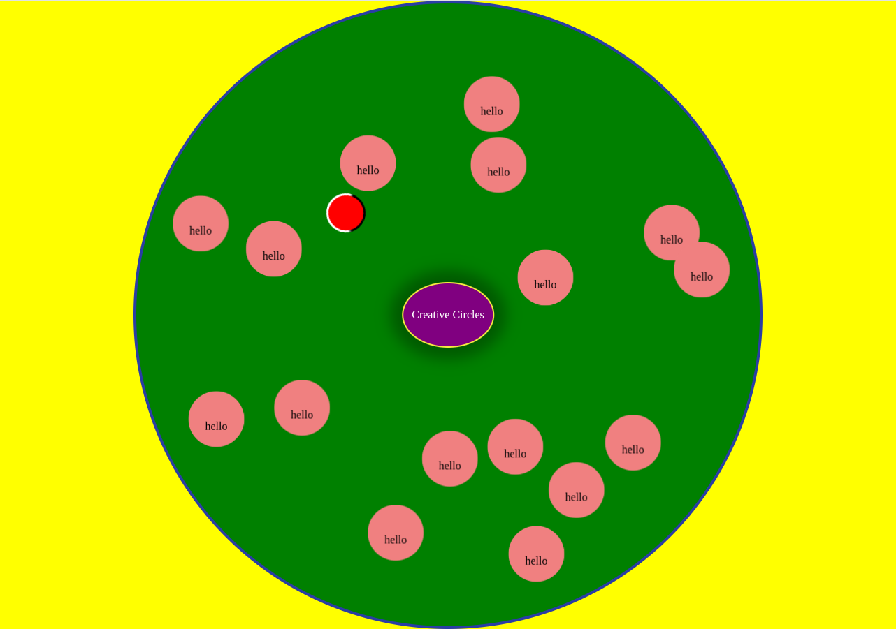

# Creative Circles
You can view the snapshot of this page in the picture below. This repo represents a beautiful page containing creative circles. It consists of two groups of circles: 1. orbit circles, and 2. really creative circles

## Orbit Circles
This contains one red circle moving from the center of the page to the outside. it also has a black border

## Really Creative Circles
Initially, the page does not have any of these group of circles. There is a big pink circle at the center of the page. When your mouse is inside this big circle, your cursor changes to the plus button.

Thereafter, if you press the click button, a really creative circle gets created at the position of your click. This really creative circle orbits around the center of the big circle.

Moreover, you can remove a really creative circle by clicking on it. When you are on the circle, the cursor changes to remove icon.